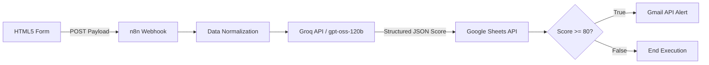

# Revenue-Driven B2B Lead Capture & Scoring Engine (n8n + Groq LLM + Google Workspace)

An automated B2B lead intake pipeline built in **n8n** that ingests form submissions via webhooks, normalizes lead metadata, evaluates lead quality using a deterministic LLM scoring engine (**Groq / gpt-oss-120b**), appends entries to **Google Sheets**, and triggers real-time **Gmail** alerts for high-priority opportunities.

---

## 📺 Project Walkthrough & Video Demo

[](https://www.loom.com)

> *Click the badge above to watch a detailed walkthrough of the running n8n pipeline, webhook ingestion, LLM scoring, and routing logic.*

---

## 📐 Technical Workflow Architecture



---

## ⚙️ Core Engineering Achievements

* **Deterministic LLM Scoring Rubric:** Designed an additive mathematical point matrix embedded inside the system prompt (`gpt-oss-120b`), enforcing strict JSON responses to eliminate non-deterministic scoring variance and model hallucinations.
* **Guaranteed Audit Log Retention:** Positioned the Google Sheets logging node prior to conditional branching, guaranteeing 100% data preservation for non-qualified leads for future nurture campaigns.
* **Resilient OAuth 2.0 Scoping:** Integrated production-scoped Google Workspace OAuth 2.0 credentials across Google Sheets and Gmail APIs to ensure persistent token refresh cycles without execution failures.
* **Sub-Second Low-Latency Execution:** Leveraged Groq's LPU acceleration infrastructure to maintain overall end-to-end processing and scoring under 300ms per form submission.

---

## 💻 Tech Stack & Frameworks

| Layer | Technology | Role |
| :--- | :--- | :--- |
| **Ingestion** | HTML5 / JavaScript | Web frontend form sending asynchronous POST payloads to n8n |
| **Orchestration** | n8n (Production / Self-Hosted) | Event routing, payload transformation, and logic evaluation |
| **AI Evaluation** | Groq API (`openai/gpt-oss-120b`) | JSON-constrained LLM lead evaluation engine |
| **Data Store** | Google Sheets API (OAuth 2.0) | Persistent ledger for all processed lead payloads and scores |
| **Notifications** | Gmail API (OAuth 2.0) | Real-time automated email alerts for sales teams |

---

## 🎯 Scoring Engine Logic & Prompt Design

To eliminate non-deterministic LLM output, the evaluation engine enforces an explicit mathematical rubric inside the system prompt:

| Evaluation Metric | Condition | Points Added |
| :--- | :--- | :--- |
| **Contact Completeness** | Full Name, Email, Phone, and Company present | +60 |
| **Mid-Tier Revenue** | $10,000 – $50,000 | +25 |
| **Enterprise Revenue** | $50,000+ | +40 |

### System Prompt Payload Configuration

```json
{
  "model": "openai/gpt-oss-120b",
  "response_format": { "type": "json_object" },
  "messages": [
    {
      "role": "system",
      "content": "You are a B2B lead scoring engine. Calculate the lead score out of 100 using this exact mathematical rubric:\n1. Base points for complete contact info (Full Name, Work Email, Phone Number, Company Name present): Add 60 points.\n2. Revenue Tier points:\n   - '$10k-$50k': Add 25 points\n   - '$50k+': Add 40 points\nReturn JSON with a single key 'score' containing the final integer sum."
    },
    {
      "role": "user",
      "content": "Name: {{ $json['Full name'] }}\nEmail: {{ $json['email'] }}\nPhone: {{ $json['Phone'] }}\nCompany: {{ $json['company'] }}\nRevenue: {{ $json['revenue-range'] }}"
    }
  ]
}
```

---

## 📂 Repository Structure

```text
├── index.html        # Client lead intake form with POST submission handler
├── workflow.json     # Exported, sanitized n8n pipeline definition
├── LICENSE           # MIT License
└── README.md         # Project documentation
```

---

## 🚀 How to Review and Deploy This Project

1. **Import Workflow:** Load `workflow.json` into your n8n workspace.
2. **Configure Credentials:**
   * Add your **Groq API Key** inside your n8n HTTP Request / Groq credential settings.
   * Authenticate **Google Sheets** and **Gmail** nodes using Google Workspace OAuth 2.0.
3. **Connect Frontend:** Update the webhook target URL in `index.html` with your active n8n production Webhook URL.
4. **Validation:** Submit a test lead through `index.html` and verify the execution flow in the n8n execution log.

---

## 📜 License

Distributed under the [MIT License](LICENSE).
